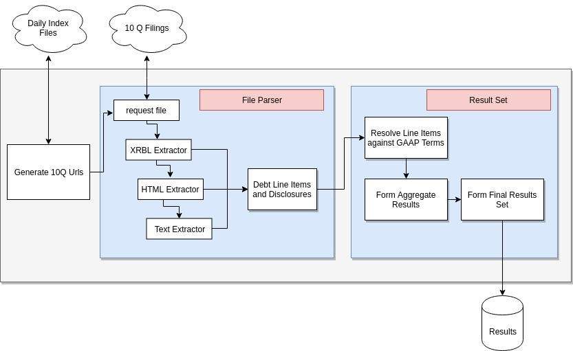
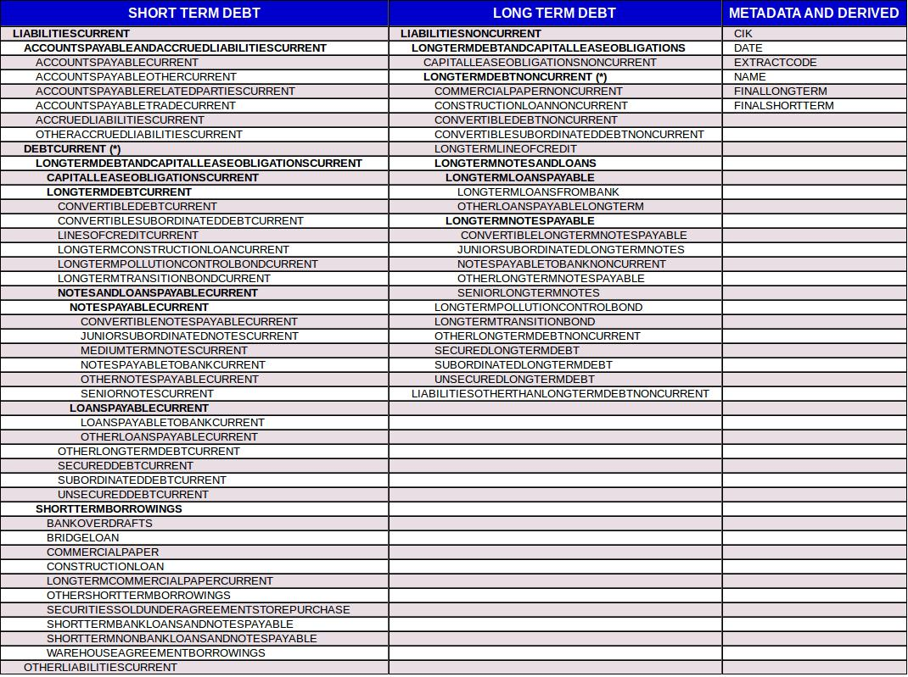

# Edgar Debt Scraper

This is an application designed for large-scale 10Q debt term extraction from the EDGAR database.  

- after cloning the git repo, try 'python -m unittest' and verify  that all tests run successfully. 
- usage examples, implementation notes, and additional data analysis are provided in the notebook directory.
- Using this application I was able to process 561,794 10Qs from 1994 - 2019 with roughly 85% of 10Qs yielding short and longterm debt levels.



## Usage
The application's main entry point is a method of the EdgarDebtScraper class called runJob.    

<pre><code>from edgarScraper.edgarDebtScraper import EdgarDebtScraper
eds = EdgarDebtScraper()
? eds.runJob()
</code></pre>

<pre><code>Signature: eds.runJob(outputFile=None, years=None, ciks=None, maxFiles=1000, nScraperProcesses=8, nIndexProcesses=8)
Docstring:
main entry method for scraping jobs.  Will write results to
the data directory in form <outputFile>_<year> and disclosures_year if
an outputFile is passed.  Otherwise, it will return a debtline item
dataframe and disclosures dataFrame if no outputFile is supplied.

Note:
    - if a list of specific ciks is supplied, maxFile limit is ignored,
    and the complete set of relevant urls will be eagerly built from
    a distributed search routing.  If no ciks are supplied it will
    lazily iterate through 10Q urls.
    - for large jobs supply an outputFile so that results can be
    periodically written to disk.  Otherwise, pandas dataFrames will
    be built in memory.

Args:
    outputFile: String name of file to write results to.
    years: list of years to restrict 10Q iteration to.
    ciks: list of ciks to restrict 10Q search to
    maxFiles: integer number of maximum files to iterate through
    nScraperProcesses: number of processes to use for processing 10Qs
    nIndexProcesses: number of processes to use for distributed cik
        search.

Returns:
    None if an outputFile is supplied.
    (dataFrame, dataFrame) if no outputFile is supplied 
</code></pre>

## Usage Example
The following shows an example job for processing the first 400 10Q files from the year 2010 using 4 processes. It should take on the order of 1-2 minutes to run and return two dataFrames. The first contains extracted line item information, the second contains free text debt disclosures. Logging output can be suppressed by changing the logging level set in edgarScraper.config.log.py

<pre><code>debtDf, disclosureDf = eds.runJob(
    years = [2010],
    maxFiles = 400,
    nScraperProcesses=8
)

    2020-05-08 20:26:05,600 dailyIndLogger INFO Searching for 10Qs in https://www.sec.gov/Archives/edgar/daily-index/2010/QTR1/
    2020-05-08 20:26:06,820 dailyIndLogger INFO Generated 25 10-Qs 
    2020-05-08 20:26:07,214 dailyIndLogger INFO Generated 50 10-Qs 
    2020-05-08 20:26:07,697 dailyIndLogger INFO Generated 75 10-Qs 
    2020-05-08 20:26:07,709 dailyIndLogger INFO Generated 100 10-Qs 
    2020-05-08 20:26:08,094 dailyIndLogger INFO Generated 125 10-Qs 
    2020-05-08 20:26:08,512 dailyIndLogger INFO Generated 150 10-Qs 
    2020-05-08 20:26:16,980 dailyIndLogger INFO Generated 175 10-Qs 
    2020-05-08 20:26:18,919 dailyIndLogger INFO Generated 200 10-Qs 
    2020-05-08 20:26:20,728 dailyIndLogger INFO Generated 225 10-Qs 
    2020-05-08 20:26:24,839 edgarScraperLog INFO finished consuming file 100
    2020-05-08 20:26:27,279 dailyIndLogger INFO Generated 250 10-Qs 
    2020-05-08 20:26:30,364 dailyIndLogger INFO Generated 275 10-Qs 
    2020-05-08 20:26:37,962 dailyIndLogger INFO Generated 300 10-Qs 
    2020-05-08 20:26:38,716 edgarScraperLog INFO finished consuming file 200
    2020-05-08 20:26:41,335 dailyIndLogger INFO Generated 325 10-Qs 
    2020-05-08 20:26:42,440 dailyIndLogger INFO Generated 350 10-Qs 
    2020-05-08 20:26:46,686 dailyIndLogger INFO Generated 375 10-Qs 
    2020-05-08 20:26:51,002 dailyIndLogger INFO Generated 400 10-Qs 
    2020-05-08 20:26:56,497 edgarScraperLog INFO finished consuming file 300
    2020-05-08 20:27:09,220 edgarScraperLog INFO finished consuming file 400
</code></pre>

The method returns two dataframes.  The first contains extracted debt information, the second contains related free text disclosures.

<pre><code>debtDf.set_index('NAME').head().T

'|                                               | CAL MAINE FOODS INC   | CONAGRA FOODS INC /DE/   | CYBERMESH INTERNATIONAL CORP.   | EAST COAST DIVERSIFIED CORP   | EFL OVERSEAS, INC.   |\n|:----------------------------------------------|:----------------------|:-------------------------|:--------------------------------|:------------------------------|:---------------------|\n| LOANSPAYABLETOBANKCURRENT                     | nan                   | nan                      | nan                             | nan                           | nan                  |\n| OTHERLOANSPAYABLECURRENT                      | nan                   | nan                      | nan                             | nan                           | nan                  |\n| MEDIUMTERMNOTESCURRENT                        | nan                   | nan                      | nan                             | nan                           | nan                  |\n| CONVERTIBLENOTESPAYABLECURRENT                | nan                   | nan                      | nan                             | nan                           | nan                  |\n| NOTESPAYABLETOBANKCURRENT                     | nan                   | nan                      | nan                             | nan                           | nan                  |\n| SENIORNOTESCURRENT                            | nan                   | nan                      | nan                             | nan                           | nan                  |\n| JUNIORSUBORDINATEDNOTESCURRENT                | nan                   | nan                      | nan                             | nan                           | nan                  |\n| OTHERNOTESPAYABLECURRENT                      | nan                   | nan                      | nan                             | nan                           | nan                  |\n| LOANSPAYABLECURRENT                           | nan                   | nan                      | nan                             | nan                           | nan                  |\n| NOTESPAYABLECURRENT                           | nan                   | 1200000.0                | nan                             | 14450.0                       | nan                  |\n| SECUREDDEBTCURRENT                            | nan                   | nan                      | nan                             | nan                           | nan                  |\n| CONVERTIBLEDEBTCURRENT                        | nan                   | nan                      | nan                             | nan                           | nan                  |\n| UNSECUREDDEBTCURRENT                          | nan                   | nan                      | nan                             | nan                           | nan                  |\n| SUBORDINATEDDEBTCURRENT                       | nan                   | nan                      | nan                             | nan                           | nan                  |\n| CONVERTIBLESUBORDINATEDDEBTCURRENT            | nan                   | nan                      | nan                             | nan                           | nan                  |\n| LONGTERMCOMMERCIALPAPERCURRENT                | nan                   | nan                      | nan                             | nan                           | nan                  |\n| LONGTERMCONSTRUCTIONLOANCURRENT               | nan                   | nan                      | nan                             | nan                           | nan                  |\n| LONGTERMTRANSITIONBONDCURRENT                 | nan                   | nan                      | nan                             | nan                           | nan                  |\n| LONGTERMPOLLUTIONCONTROLBONDCURRENT           | nan                   | nan                      | nan                             | nan                           | nan                  |\n| OTHERLONGTERMDEBTCURRENT                      | nan                   | nan                      | nan                             | nan                           | nan                  |\n| LINESOFCREDITCURRENT                          | nan                   | nan                      | nan                             | nan                           | nan                  |\n| NOTESANDLOANSPAYABLECURRENT                   | nan                   | 1200000.0                | nan                             | 14450.0                       | nan                  |\n| LONGTERMDEBTCURRENT                           | 39485.0               | 1200000.0                | nan                             | 14450.0                       | nan                  |\n| CAPITALLEASEOBLIGATIONSCURRENT                | nan                   | nan                      | nan                             | nan                           | nan                  |\n| BANKOVERDRAFTS                                | nan                   | nan                      | nan                             | nan                           | nan                  |\n| COMMERCIALPAPER                               | nan                   | nan                      | nan                             | nan                           | nan                  |\n| BRIDGELOAN                                    | nan                   | nan                      | nan                             | nan                           | nan                  |\n| CONSTRUCTIONLOAN                              | nan                   | nan                      | nan                             | nan                           | nan                  |\n| SHORTTERMBANKLOANSANDNOTESPAYABLE             | nan                   | nan                      | nan                             | nan                           | nan                  |\n| SHORTTERMNONBANKLOANSANDNOTESPAYABLE          | nan                   | nan                      | nan                             | nan                           | nan                  |\n| SECURITIESSOLDUNDERAGREEMENTSTOREPURCHASE     | nan                   | nan                      | nan                             | nan                           | nan                  |\n| WAREHOUSEAGREEMENTBORROWINGS                  | nan                   | nan                      | nan                             | nan                           | nan                  |\n| OTHERSHORTTERMBORROWINGS                      | nan                   | nan                      | nan                             | nan                           | nan                  |\n| DEBTCURRENT                                   | 39485.0               | 260500000.0              | nan                             | 14450.0                       | nan                  |\n| LONGTERMDEBTANDCAPITALLEASEOBLIGATIONSCURRENT | 39485.0               | 260500000.0              | nan                             | 14450.0                       | nan                  |\n| SHORTTERMBORROWINGS                           | nan                   | nan                      | nan                             | nan                           | nan                  |\n| LIABILITIESCURRENT                            | 146070.0              | 2007500000.0             | 249832.0                        | 106862.0                      | 16287.0              |\n| ACCOUNTSPAYABLEANDACCRUEDLIABILITIESCURRENT   | 82003.0               | 1561700000.0             | 45900.0                         | nan                           | 9950.0               |\n| ACCOUNTSPAYABLECURRENT                        | nan                   | 956400000.0              | nan                             | nan                           | nan                  |\n| ACCOUNTSPAYABLETRADECURRENT                   | nan                   | nan                      | nan                             | nan                           | nan                  |\n| ACCOUNTSPAYABLEOTHERCURRENT                   | nan                   | nan                      | nan                             | nan                           | nan                  |\n| ACCRUEDLIABILITIESCURRENT                     | nan                   | nan                      | 45900.0                         | nan                           | nan                  |\n| OTHERACCRUEDLIABILITIESCURRENT                | nan                   | 605300000.0              | nan                             | nan                           | nan                  |\n| ACCOUNTSPAYABLERELATEDPARTIESCURRENT          | nan                   | nan                      | nan                             | nan                           | nan                  |\n| OTHERLIABILITIESCURRENT                       | nan                   | nan                      | nan                             | nan                           | nan                  |\n| LONGTERMNOTESPAYABLE                          | nan                   | 3027200000.0             | nan                             | nan                           | nan                  |\n| OTHERLONGTERMNOTESPAYABLE                     | nan                   | nan                      | nan                             | nan                           | nan                  |\n| NOTESPAYABLETOBANKNONCURRENT                  | nan                   | nan                      | nan                             | nan                           | nan                  |\n| CONVERTIBLELONGTERMNOTESPAYABLE               | nan                   | nan                      | nan                             | nan                           | nan                  |\n| SENIORLONGTERMNOTES                           | nan                   | 3027200000.0             | nan                             | nan                           | nan                  |\n| JUNIORSUBORDINATEDLONGTERMNOTES               | nan                   | nan                      | nan                             | nan                           | nan                  |\n| OTHERLOANSPAYABLELONGTERM                     | nan                   | nan                      | nan                             | nan                           | nan                  |\n| LONGTERMLOANSFROMBANK                         | nan                   | nan                      | nan                             | nan                           | nan                  |\n| LONGTERMNOTESANDLOANS                         | nan                   | 3027200000.0             | nan                             | nan                           | nan                  |\n| LONGTERMLOANSPAYABLE                          | nan                   | nan                      | nan                             | nan                           | nan                  |\n| LONGTERMDEBTNONCURRENT                        | 112272.0              | 3223100000.0             | nan                             | nan                           | nan                  |\n| OTHERLONGTERMDEBTNONCURRENT                   | nan                   | nan                      | nan                             | nan                           | nan                  |\n| LONGTERMPOLLUTIONCONTROLBOND                  | nan                   | nan                      | nan                             | nan                           | nan                  |\n| LONGTERMTRANSITIONBOND                        | nan                   | nan                      | nan                             | nan                           | nan                  |\n| CONVERTIBLESUBORDINATEDDEBTNONCURRENT         | nan                   | nan                      | nan                             | nan                           | nan                  |\n| CONVERTIBLEDEBTNONCURRENT                     | nan                   | nan                      | nan                             | nan                           | nan                  |\n| UNSECUREDLONGTERMDEBT                         | nan                   | nan                      | nan                             | nan                           | nan                  |\n| SUBORDINATEDLONGTERMDEBT                      | nan                   | 195900000.0              | nan                             | nan                           | nan                  |\n| SECUREDLONGTERMDEBT                           | nan                   | nan                      | nan                             | nan                           | nan                  |\n| CONSTRUCTIONLOANNONCURRENT                    | nan                   | nan                      | nan                             | nan                           | nan                  |\n| COMMERCIALPAPERNONCURRENT                     | nan                   | nan                      | nan                             | nan                           | nan                  |\n| LONGTERMLINEOFCREDIT                          | nan                   | nan                      | nan                             | nan                           | nan                  |\n| CAPITALLEASEOBLIGATIONSNONCURRENT             | nan                   | nan                      | nan                             | nan                           | nan                  |\n| LONGTERMDEBTANDCAPITALLEASEOBLIGATIONS        | nan                   | nan                      | nan                             | nan                           | nan                  |\n| LIABILITIESOTHERTHANLONGTERMDEBTNONCURRENT    | 3005.0                | nan                      | nan                             | nan                           | nan                  |\n| LIABILITIESNONCURRENT                         | 290862.0              | nan                      | nan                             | 106862.0                      | nan                  |\n| CIK                                           | 16160                 | 23217                    | 1367617                         | 1256540                       | 1448806              |\n| DATE                                          | 2010-01-05 00:00:00   | 2010-01-05 00:00:00      | 2010-01-05 00:00:00             | 2010-01-05 00:00:00           | 2010-01-05 00:00:00  |\n| FINALSHORTTERM                                | 39485.0               | 260500000.0              | 45900.0                         | 14450.0                       | 9950.0               |\n| FINALLONGTERM                                 | 112272.0              | 3223100000.0             | nan                             | 106862.0                      | nan                  |\n| EXTRACTCODE                                   | HTML                  | XBRL                     | HTML                            | HTML                          | HTML                 |'
</code></pre>


## Data Heirachy

The application attempts to find relevant debt-information for 71 different fields.  These fields and the accompanying taxonomy are taken from information found on https://xbrl.us/.  

Final short and long term debt levels are calculated based upon the following strategy:

  1) If values exist for key fields like ```LONGTERMDEBTNONCURRENT``` or ```DEBTCURRENT``` return these values as the final long and short-term debt levels.

  2) Else, attempt to form final results by aggregating up component subfields. 

  3) Finally, if the first two approaches fail, attempt to form results by taking values from parent-fields (usually total current / non current liabilities) and subtracting "sibling-level" fields where applicable.
    
For more details on this aggregation logic please see the source code contained in ```edgarScraper.pipelineIO.resultset.py```

As with other implementation decisions, there are pros and cons to the approach I took.  A pro is that the logic employed closely matches standard GAAP Taxonomies and allows for a robust and systematic way of determining overall debt levels.  Indeed, using this approach I was able to get viable values for close to 90% of all 10-Q filings from 1994-2018.  

**The disadvantage to this approach is that it can sometimes lead to apples-to-oranges type comparisons.  For instance, for a given 10-Q, the only short term debt field recovered may be a company's total current liabilities - either because the company provided little information or extraction faired poorly.  This value will likely overstate the company's short term debt (as it can include things like payroll and taxes).  For a different 10-Q, a more granular short-term debt field may be the only one resolved.  Under the scheme advanced, both values will appear as final short term debt levels.**  

### Data Field Groupings and Hierarchy

